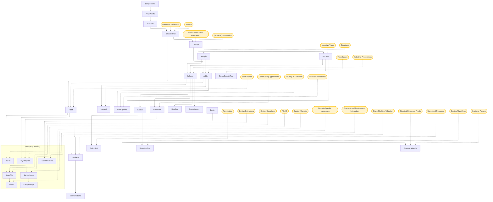

# LeanLangur

This directory contains examples and experiments with the Lean 4 programming language and theorem prover. The core tutorial files are organized from preliminaries through programming with proofs and metaprogramming, followed by exercises.

## Relations between files

The following is a mermaid diagram of dependencies among files and where concepts are introduced.

## Suggested Order

The following is a suggested order of files to work through. Note that this assumes that you have a background in basic tactic proofs in Lean such as based on _Glimpse of Lean_.

### Preliminaries

* **[SimpleTerms.lean](SimpleTerms.lean)**: Basic Lean terms, commands, and simple definitions.
* **[PropsAndProofs](PropsProofs.lean)**: Propositions as types, proof terms, implication, conjunction, disjunction, and related proof patterns.
* **[SumToN.lean](SumToN.lean)**: Recursive programs, basic functions and proofs, and proofs by induction.

### Programming with Proofs

* **[SmallestNat.lean](SmallestNat.lean)**: Functions and Proofs for finding the smallest element in a list of natural numbers, with Macros and notation.
* **[ListOps.lean](ListOps.lean)**: List operations, Implicit and Explicit Parameters, and (Monadic) Do Notation for lists.
* **[People.lean](People.lean)**: Structures and simple data types with named fields.
* **[BinTree.lean](BinTree.lean)**: Inductive Types, binary trees, conversion to lists, and membership proofs.
* **[IsEven.lean](IsEven.lean)**: Inductive Propositions and the `grind` tactic.
* **[Adder.lean](Adder.lean)**: Typeclasses, custom `Add` instances, and typeclass inference.
* **[NonAtom.lean](NonAtom.lean)**: Constructing Typeclasses with multiple fields and axioms.
* **[Smallest.lean](Smallest.lean)**: Finding the smallest element in a list using typeclasses.
* **[Largest.lean](Largest.lean)**: Finding the largest element in a list with proofs of correctness.
* **[FunEquality.lean](FunEquality.lean)**: Equality of Functions, proof irrelevance, and Decision Procedures.
* **[FibM.lean](FibM.lean)**: Efficient Fibonacci computation using memoization with the State Monad.
* **[CatalanM.lean](CatalanM.lean)**: Memoized Recursion for Catalan-number computation using the State Monad.
* **[Sorted.lean](Sorted.lean)**: Sorted lists, typeclasses, and equivalent definitions.
* **[QuickSort.lean](QuickSort.lean)**: Quicksort with Termination and correctness-oriented proofs.
* **[SelectionSort.lean](SelectionSort.lean)**: Sorting Algorithms through selection sort, with membership and sortedness proofs.
* **[BinarySearchTree.lean](BinarySearchTree.lean)**: Binary search trees and their invariants.
* **[PowerIrrationals](PowerIrrational.lean)**: Irrational Powers, rationality, and Classical Existence Proofs.

### Metaprogramming

* **[PyFor.lean](PyFor.lean)**: Syntax Extensions, Macros, and Python-style list comprehensions.
* **[StackMachine.lean](StackMachine.lean)**: A stack machine with Inductive Types, Inductive Propositions, and Stack-Machine Validation.
* **[LoadFile.lean](LoadFile.lean)**: File IO, Syntax Quotations, and commands for loading data.
* **[FileM.lean](FileM.lean)**: Custom Monads, safety predicates, and proofs about file programs.
* **[LangurLang.lean](LangurLang.lean)**: Domain-Specific Languages, shallow embeddings, and imperative programs.
* **[LangurLeaps.lean](LangurLeaps.lean)**: Examples and syntax extensions for the `#leap` command and `climb%` macro.
* **[TryInterpret.lean](TryInterpret.lean)**: Frontend and Environment Interaction, tactic extraction, and Decision Procedures experiments.

### Exercises

* **[Combinations.lean](Combinations.lean)**: Exercises around combinations.
* **[Eratosthenes.lean](Eratosthenes.lean)**: Exercises based on the sieve of Eratosthenes.

## Dependencies Source

