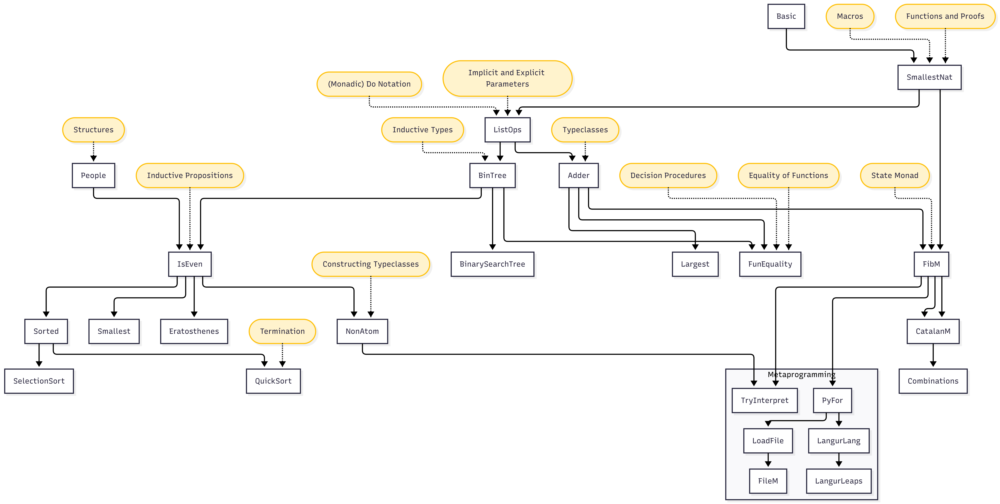
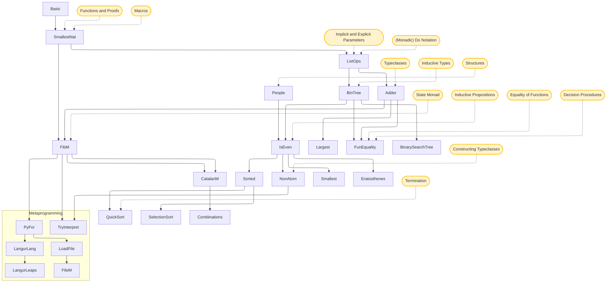

# LeanLangur

This directory contains examples and experiments with the Lean 4 programming language and theorem prover. The files are organized from basic concepts to more advanced topics like metaprogramming and domain-specific languages.

## Relations between files

The following is a mermaid diagram of dependencies among files and where concepts are introduced. We don't include details of where metaprogramming concepts are introduced.

## File Descriptions

### Introduction and Basics

* **[Basic.lean](Basic.lean)**: A gentle introduction to running Lean, using `#eval` and `#check`, and defining simple functions.
* **[IsEven.lean](IsEven.lean)**: Demonstrates basic inductive predicates and the use of the `grind` tactic.
* **[People.lean](People.lean)**: Illustrates the use of `Structure` for simple data types with named fields.
* **[Etc.lean](Etc.lean)**: Covers basic custom types (like `MyEmpty` and `MyFalse`) and recursion on empty types.
* **[Adder.lean](Adder.lean)**: Explains the `Add` typeclass, creating custom instances, and typeclass inference.
* **[ListOps.lean](ListOps.lean)**: Introduces list operations, explicit/implicit parameters, and `do` notation for lists.
* **[NonAtom.lean](NonAtom.lean)**: Shows how to define and use custom typeclasses with multiple fields and axioms.

### Data Structures and Algorithms

* **[BinTree.lean](BinTree.lean)**: Defines a basic binary tree, conversion to lists, and membership proofs.
* **[BinarySearchTree.lean](BinarySearchTree.lean)**: A more advanced implementation of Binary Search Trees.
* **[SmallestNat.lean](SmallestNAt.lean)**: Finding the smallest element in a list of natural numbers, introducing notation.
* **[Smallest.lean](Smallest.lean)**: Finding the smallest element in a list in general using typeclasses.
* **[Largest.lean](Largest.lean)**: Implementing the "largest element" function with proofs of correctness, generalized for any linear order.
* **[Sorted.lean](Sorted.lean)**: A typeclass representing a list being sorted, a proof that this is equivalent to another definition.
* **[SelectionSort.lean](SelectionSort.lean)**: An implementation of the Selection Sort algorithm.
* **[QuickSort.lean](QuickSort.lean)**: A complete implementation of the Quicksort algorithm with associated proofs.

### Monads and Memoization

* **[FibM.lean](FibM.lean)**: Efficiently computing Fibonacci numbers using memoization with the `State` monad.
* **[CatalanM.lean](CatalanM.lean)**: Memoized computation of Catalan numbers.

### IO and File Handling (with Metaprogramming)

* **[LoadFile.lean](LoadFile.lean)**: Examples of performing file I/O operations in Lean.
* **[FileM.lean](FileM.lean)**: A custom monad (`FileM`) designed for managing file operations.

### Metaprogramming and Languages

* **[StackMachine.lean](StackMachine.lean)**: Defines a simple stack-based machine with instructions and an execution engine.
* **[PyFor.lean](PyFor.lean)**: Implements Python-style list comprehensions using Lean's metaprogramming capabilities.
* **[LangurLang.lean](LangurLang.lean)**: A tiny imperative language (IMP-style) with variables, assignments, and control flow.
* **[LangurLeaps.lean](LangurLeaps.lean)**: Examples and syntax extensions (the `#leap` command) for using `LangurLang`.
* **[TryInterpret.lean](TryInterpret.lean)**: Advanced customization of the Lean frontend and environment manipulation.

## Dependencies Source

